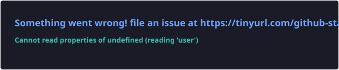

  
  
   

  

   

  <!-- Social Icons -->
  

    
    
    
  

---

### 👨‍💻 About Me

- 🔭 I’m currently working on **Unified Org Workspace**
- 🌱 I’m currently learning **System Design**
- 👯 I’m looking to collaborate on **Full stack + AI Projects**
- 💬 Ask me about **React, Node.js, Flutter, React Native, Docker**
- 📫 How to reach me: **siddheshdhatrak06@gmail.com**
- ⚡ Fun fact: **Am a full time developer and part time competitive programmer**

---

### 🚀 Tech Stack

  
#### 🌐 Frontend

  

#### ⚙️ Backend

  

#### 📱 Mobile Development

  

#### 🛠 DevOps, Tools & Architecture

  

---

### 📊 GitHub Stats & Rankings

  
  

 

  

 

  
  

---

### 🎨 Contribution Activity

  

 

  

